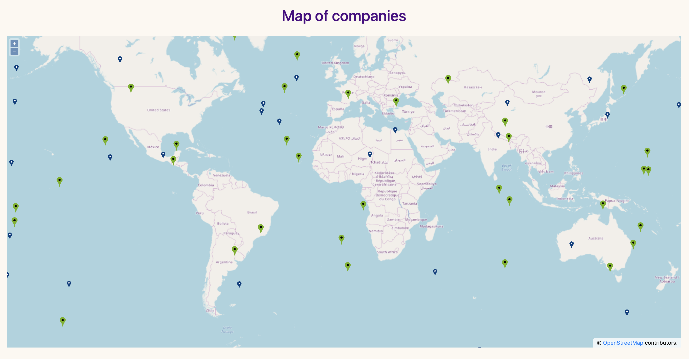
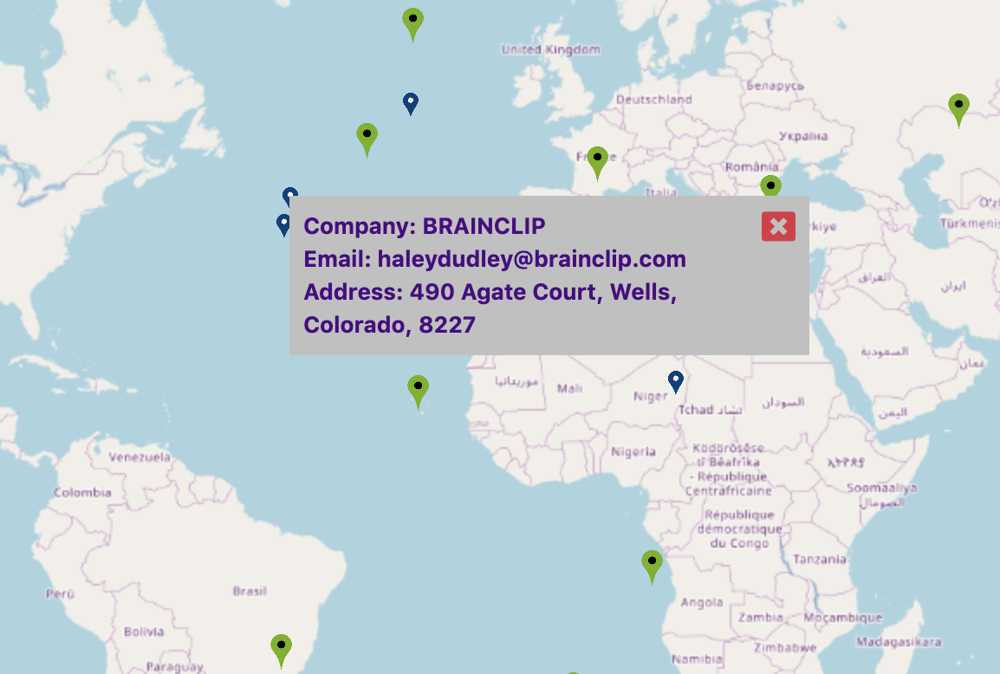

# MapOSM

## Description
Openlayers 6.0.1 is connected in this application. There are markers on the map. 
Markers are displayed based on the coordinates for each company. 
Depending on whether the company is “active” or not, the marker has a different 
color. If the company is active the marker colors are green. If the company is 
not active - blue. There is one service involved in the http request for data from 
the Json File. When you click on the marker, Popup appears. It displays some parameters 
of the company. To display the content in the popup, the DomSanitizer pipe was written. 
DomSanitizer is an Angular service that helps prevent attackers from injecting client-side 
malicious scripts into web pages. This window can be closed by clicking on the icon in the 
upper right corner. For styling used scss. The following libraries were also used: 
Angular 8.3.0, RxJS 6.4.0, Openlayers 6.0.1, Bootstrap 4.3.1, Font Awesome 5.11.2.

This project was generated with [Angular CLI](https://github.com/angular/angular-cli) version 8.3.0.

## Development server

Run `ng serve` for a dev server. Navigate to `http://localhost:4200/`. The app will automatically reload if you change any of the source files.

## Code scaffolding

Run `ng generate component component-name` to generate a new component. You can also use `ng generate directive|pipe|service|class|guard|interface|enum|module`.

## Build

Run `ng build` to build the project. The build artifacts will be stored in the `dist/` directory. Use the `--prod` flag for a production build.

## Running unit tests

Run `ng test` to execute the unit tests via [Karma](https://karma-runner.github.io).

## Running end-to-end tests

Run `ng e2e` to execute the end-to-end tests via [Protractor](http://www.protractortest.org/).

## Further help

To get more help on the Angular CLI use `ng help` or go check out the [Angular CLI README](https://github.com/angular/angular-cli/blob/master/README.md).
